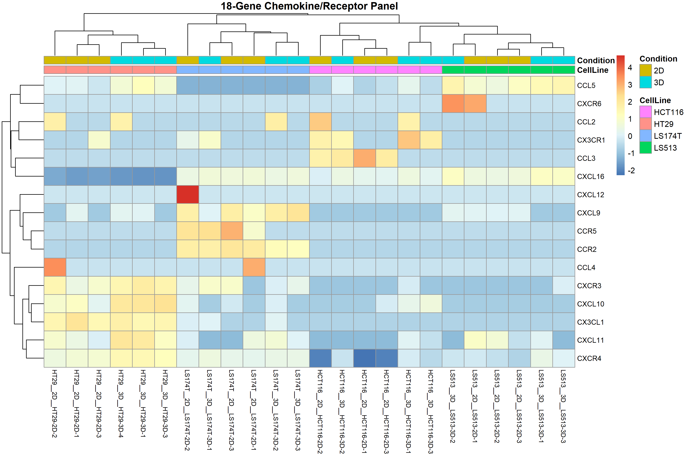
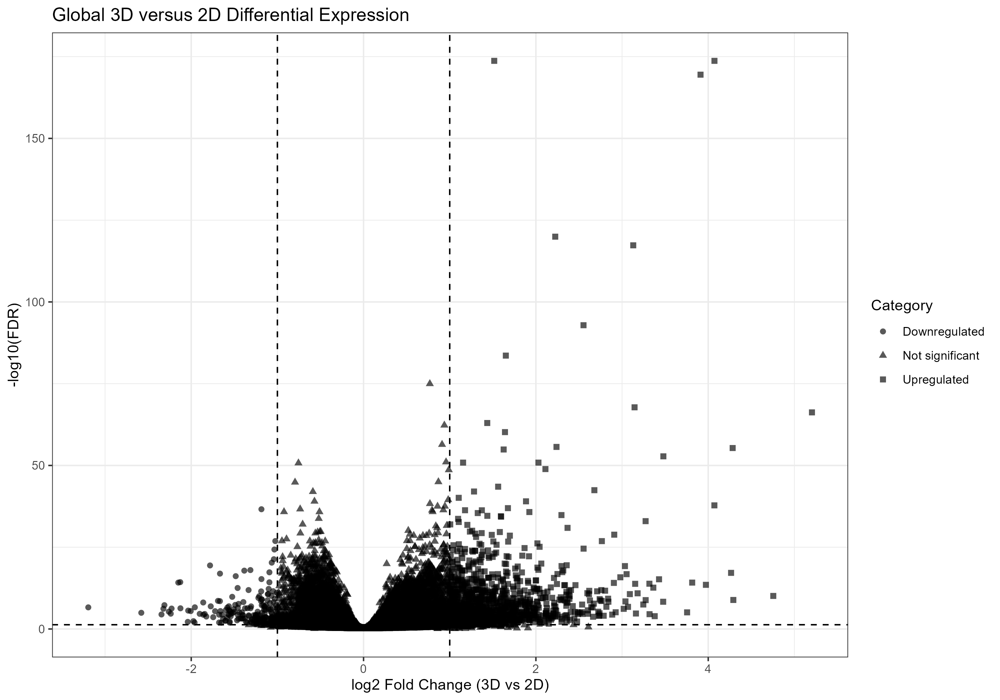
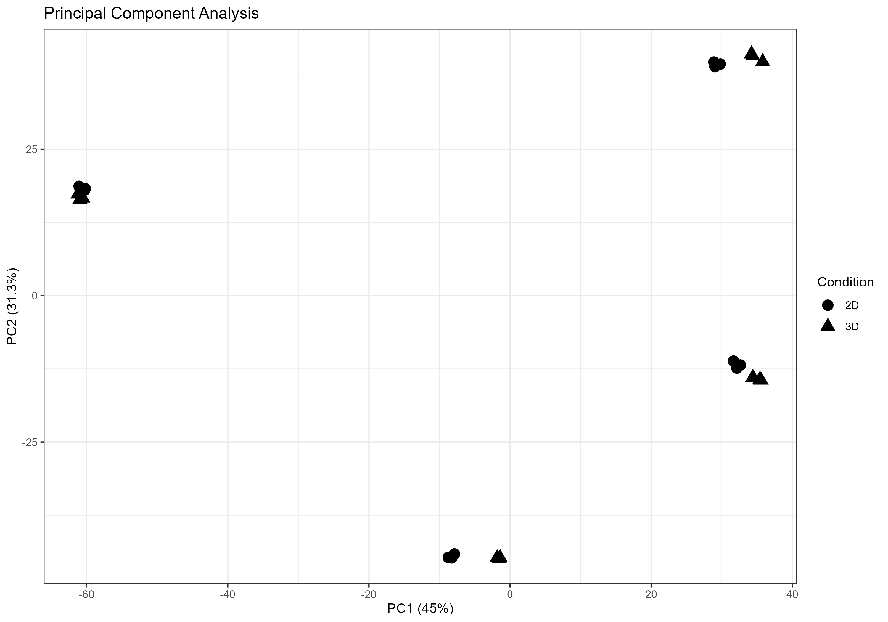
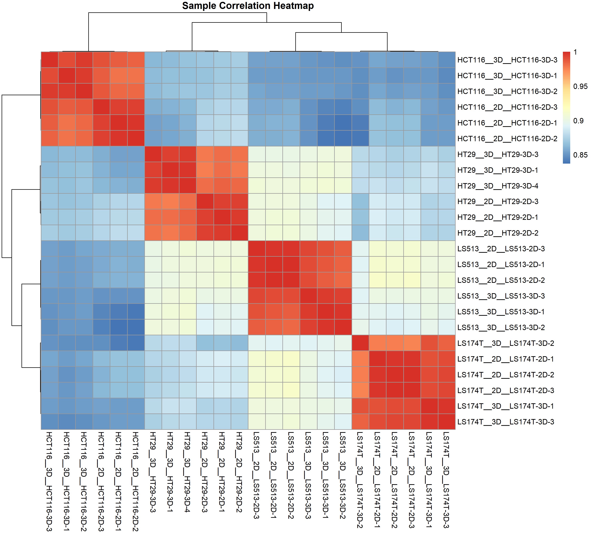

# CRC Cell-Line Microarray Analysis

**Exploratory transcriptomic analysis of 2D versus 3D culture in colorectal cancer cell-line models**



## Research question

> **How does 3D culture alter the transcriptional landscape of colorectal cancer cell-line models compared with conventional 2D culture, with particular emphasis on chemokine–receptor signaling?**

## Why this analysis?

Three-dimensional culture can provide a more physiologically relevant
experimental context than conventional 2D culture. This project uses
public transcriptomic data to examine how the transition from 2D to 3D
culture affects gene-expression patterns across multiple CRC cell lines.

A focused chemokine–receptor panel was then examined to investigate
whether these signaling-associated genes show consistent or
cell-line-specific transcriptional responses.

## Dataset and experimental design

| Feature | Description |
|---|---|
| GEO accession | GSE185055 |
| Model | Colorectal cancer cell lines |
| Cell lines | HCT116, HT29, LS174T, LS513 |
| Conditions | 2D vs 3D culture |
| Biological replicates | n = 3 per cell line × condition |
| Final biological samples | 24 |
| Technical replicates | Collapsed before final DE analysis |
| Focused panel | 18 chemokine/receptor genes |

## Analytical workflow

```text
GEO dataset
     <U+2193>
Sample and metadata curation
     <U+2193>
Technical replicate collapse
     <U+2193>
Expression QC
     <U+2193>
PCA + sample correlation
     <U+2193>
Differential expression
     <U+2193>
Global 3D vs 2D
     <U+2193>
Within-cell-line comparisons
     <U+2193>
18-gene chemokine–receptor panel
     <U+2193>
Visualization and biological interpretation
```

## Key results

### 1. Broad transcriptional remodeling

The global 3D-versus-2D analysis evaluated 19,474 genes after
expression filtering. Using FDR < 0.05 and |log2FC| >= 1,
**1,507 genes** met the predefined significance criteria.



### 2. The response depends on the cell-line model

The number of significant genes differed substantially among the
four CRC models:

| Cell line | Significant genes |
|---|---:|
| HCT116 | 1,100 |
| HT29 | 1,870 |
| LS174T | 833 |
| LS513 | 1,033 |

This indicates that the transcriptional response to 3D culture is
not completely uniform across CRC cell lines.

### 3. Sample-level structure

PCA and sample-correlation analysis were used to assess global
sample structure and replicate consistency before interpretation
of differential expression.





### 4. Chemokine–receptor signaling

An 18-gene panel was evaluated:

`CXCL9/CXCL10/CXCL11–CXCR3`  
`CCL3/CCL4/CCL5–CCR5`  
`CCL2/CCL7/CCL8–CCR2`  
`CXCL12–CXCR4`  
`CXCL16–CXCR6`  
`CX3CL1–CX3CR1`

All 18 genes were identifiable in the raw biological count matrix,
while five remained available after the final DESeq2 expression
filtering step. This distinction is important: absence from the
filtered DESeq2 object was not interpreted as biological absence
from the original dataset.


## Research questions <U+2192> answers

### Does 3D culture induce broad transcriptional changes?

**Yes.** The global comparison identified 1,507 genes meeting the
predefined FDR and effect-size criteria.

### Is the response consistent across CRC cell lines?

**Not completely.** The number and magnitude of significant changes
varied across HCT116, HT29, LS174T and LS513, indicating substantial
cell-line dependence.

### Do chemokine/receptor genes respond to 3D culture?

**Selected genes show condition-associated changes, but the response
is not uniform across the panel.** CXCL10 and CCL5 showed significant
global 3D-versus-2D changes under the predefined criteria, while
cell-line-specific analyses revealed additional differences such as
strong CXCR4-associated changes in HCT116 and HT29.
## Key Results

### Chemokine–Receptor Expression Landscape


### Principal Component Analysis


### Sample Correlation


### Global 3D vs 2D Differential Expression


### What does this mean biologically?

The results support the hypothesis that 3D culture can remodel
transcriptional programs in CRC cell-line models and that chemokine–
receptor signaling may contribute to this model-dependent response.
The findings are exploratory and should be validated in additional
experimental systems.

## Reproducibility

The repository contains curated metadata, selected analysis outputs,
visualizations, and R analysis scripts. Raw GEO data are not
redistributed and can be retrieved using accession **GSE185055**.

## Repository structure

```text
figures/       Key publication-style figures
scripts/       R analysis workflow
results/       Selected final result tables
data/          Curated sample metadata
docs/          Methodology and analysis report
```

## Limitations

- This analysis uses established CRC cell-line models rather than
  primary patient tumors.
- The study is exploratory and does not constitute clinical validation.
- Cell-line-specific responses limit interpretation of the panel as
  a universal CRC signature.
- Expression filtering affects which genes enter downstream
  differential-expression testing.

## Citation

Dataset: GSE185055, NCBI Gene Expression Omnibus.

## Author

**Dorsa Shaghaghian**  
Computational biology | Transcriptomics | Molecular biotechnology
